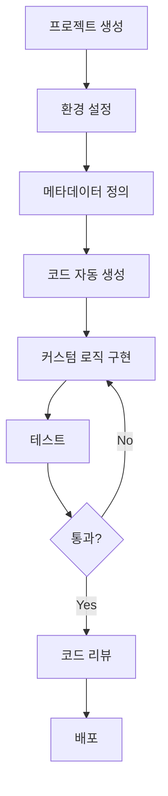

# 개발 워크플로우 가이드라인

이 문서는 ${PLATFORM_NAME} 플랫폼에서의 표준 개발 워크플로우를 정의합니다.

## 🔄 전체 개발 프로세스



## 1️⃣ 프로젝트 생성

### 새 프로젝트 생성
```bash
cd /var/services/homes/jungsam/dev/dockers/platforms/${PLATFORM_NAME}/projects
./create-project.sh -p ${PLATFORM_NAME} -n <project-name> -u <github-user> -d "Project description"
```

### 생성 후 자동 구성
- ✅ 포트 자동 할당 (10개)
- ✅ GitHub 저장소 생성
- ✅ 환경변수 파일 생성
- ✅ Docker 설정 생성
- ✅ 기본 프로젝트 구조 생성

### 생성 확인
```bash
# 프로젝트 디렉토리 확인
cd projects/<project-name>
ls -la

# 할당된 포트 확인
cat .env | grep PORT

# Docker 컨테이너 시작
docker-compose up -d
```

## 2️⃣ 환경 설정

### 환경변수 확인 및 수정
```bash
# .env 파일 확인
cat .env

# 필요한 경우 커스텀 환경변수 추가
vim .env
```

### 주요 환경변수
```bash
# 자동 할당된 포트 (절대 수정하지 마세요)
PROJECT_SSH_PORT=21XXX
PROJECT_API_PORT=21XXX
PROJECT_FRONTEND_PORT=21XXX

# 데이터베이스 연결 (플랫폼 공유)
POSTGRES_HOST=${BASE_IP}
POSTGRES_PORT=${PLATFORM_POSTGRES_PORT}
DATABASE_URL=postgresql://...

# 커스텀 환경변수 (프로젝트별 추가)
JWT_SECRET=your-secret-here
API_KEY=your-api-key
```

### 데이터베이스 생성
```bash
# 프로젝트 전용 데이터베이스 생성
npm run db:create

# 또는 수동 생성
psql -h ${BASE_IP} -p ${PLATFORM_POSTGRES_PORT} -U ${POSTGRES_USER}
CREATE DATABASE project_<project-name>;
```

## 3️⃣ 메타데이터 정의

### 메타데이터 구조
```
projects/<project-name>/
└── metadata/
    ├── tables/          # 테이블 정의
    │   ├── users.json
    │   ├── posts.json
    │   └── comments.json
    ├── relationships/   # 관계 정의
    │   └── user-posts.json
    └── apis/           # API 정의
        └── graphql-schema.json
```

### 테이블 메타데이터 예시 (metadata/tables/users.json)
```json
{
  "tableName": "users",
  "description": "사용자 정보 테이블",
  "columns": [
    {
      "name": "id",
      "type": "uuid",
      "primaryKey": true,
      "generated": true
    },
    {
      "name": "email",
      "type": "varchar",
      "length": 255,
      "unique": true,
      "nullable": false
    },
    {
      "name": "password",
      "type": "varchar",
      "length": 255,
      "nullable": false,
      "exclude": ["graphql", "api"]
    },
    {
      "name": "role",
      "type": "enum",
      "enum": ["USER", "ADMIN"],
      "default": "USER"
    },
    {
      "name": "createdAt",
      "type": "timestamp",
      "default": "now()"
    }
  ],
  "indexes": [
    {
      "columns": ["email"],
      "unique": true
    }
  ]
}
```

### 관계 메타데이터 예시 (metadata/relationships/user-posts.json)
```json
{
  "type": "one-to-many",
  "from": "users",
  "to": "posts",
  "foreignKey": "user_id",
  "cascade": {
    "delete": true,
    "update": true
  }
}
```

## 4️⃣ 코드 자동 생성

### 생성 가능한 코드
- **TypeORM Entities**: 데이터베이스 모델
- **GraphQL Schema**: GraphQL 타입 정의
- **Resolvers**: GraphQL 리졸버 (CRUD)
- **Services**: 비즈니스 로직 (기본 CRUD)
- **Migrations**: 데이터베이스 마이그레이션
- **Tests**: 단위 테스트 템플릿

### 코드 생성 실행
```bash
# 전체 코드 생성
npm run generate:all

# 개별 생성
npm run generate:entities    # TypeORM entities
npm run generate:schema      # GraphQL schema
npm run generate:resolvers   # Resolvers
npm run generate:migrations  # DB migrations
npm run generate:tests       # Test templates
```

### 생성된 코드 예시

**TypeORM Entity (src/entities/User.ts)**
```typescript
import { Entity, PrimaryGeneratedColumn, Column, CreateDateColumn } from 'typeorm';

@Entity('users')
export class User {
  @PrimaryGeneratedColumn('uuid')
  id: string;

  @Column({ unique: true })
  email: string;

  @Column()
  password: string;

  @Column({ type: 'enum', enum: ['USER', 'ADMIN'], default: 'USER' })
  role: string;

  @CreateDateColumn()
  createdAt: Date;
}
```

**GraphQL Schema (src/schema/user.graphql)**
```graphql
type User {
  id: ID!
  email: String!
  role: UserRole!
  createdAt: DateTime!
}

enum UserRole {
  USER
  ADMIN
}

type Query {
  user(id: ID!): User
  users(limit: Int, offset: Int): [User!]!
}

type Mutation {
  createUser(input: CreateUserInput!): User!
  updateUser(id: ID!, input: UpdateUserInput!): User!
  deleteUser(id: ID!): Boolean!
}

input CreateUserInput {
  email: String!
  password: String!
  role: UserRole
}

input UpdateUserInput {
  email: String
  password: String
  role: UserRole
}
```

### Watch Mode (자동 재생성)
```bash
# 메타데이터 변경 감지 시 자동 재생성
npm run generate:watch

# 백그라운드 실행
npm run generate:watch &
```

## 5️⃣ 커스텀 로직 구현

### 생성된 코드 수정 규칙

#### ✅ 권장: 확장 패턴 사용
```typescript
// src/services/user.service.custom.ts (신규 파일)
import { UserService } from './user.service'; // 자동 생성된 파일

export class UserServiceCustom extends UserService {
  // 커스텀 메서드 추가
  async findByEmail(email: string) {
    return this.repository.findOne({ where: { email } });
  }

  // 기존 메서드 오버라이드
  async create(data: CreateUserInput) {
    // 비밀번호 해싱 추가
    const hashedPassword = await bcrypt.hash(data.password, 10);
    return super.create({ ...data, password: hashedPassword });
  }
}
```

#### ❌ 비권장: 자동 생성 파일 직접 수정
```typescript
// src/services/user.service.ts (자동 생성 파일)
// ⚠️ 이 파일을 수정하면 재생성 시 덮어씌워집니다!
```

### 커스텀 코드 위치
```
src/
├── entities/           # 자동 생성 (수정 금지)
├── schema/            # 자동 생성 (수정 금지)
├── resolvers/         # 자동 생성 (수정 금지)
├── services/          # 자동 생성 (수정 금지)
│
├── custom/            # 커스텀 코드 (권장)
│   ├── services/
│   │   └── user.service.custom.ts
│   ├── resolvers/
│   │   └── user.resolver.custom.ts
│   └── validators/
│       └── user.validator.ts
│
└── utils/             # 공통 유틸리티
    ├── auth.ts
    └── validation.ts
```

### 커스텀 Resolver 예시
```typescript
// src/custom/resolvers/user.resolver.custom.ts
import { Resolver, Mutation, Args } from '@nestjs/graphql';
import { UserServiceCustom } from '../services/user.service.custom';

@Resolver('User')
export class UserResolverCustom {
  constructor(private userService: UserServiceCustom) {}

  @Mutation()
  async login(@Args('email') email: string, @Args('password') password: string) {
    // 커스텀 로그인 로직
    const user = await this.userService.findByEmail(email);
    // ... JWT 생성 로직
    return { token, user };
  }
}
```

## 6️⃣ 테스트

### 테스트 구조
```
tests/
├── unit/              # 단위 테스트
│   ├── services/
│   │   └── user.service.spec.ts
│   └── resolvers/
│       └── user.resolver.spec.ts
├── integration/       # 통합 테스트
│   └── user-api.spec.ts
└── e2e/              # E2E 테스트
    └── user-flow.spec.ts
```

### 테스트 실행
```bash
# 전체 테스트
npm test

# 특정 테스트
npm test -- user.service.spec.ts

# Watch mode
npm test -- --watch

# Coverage
npm test -- --coverage
```

### 테스트 작성 예시
```typescript
// tests/unit/services/user.service.spec.ts
import { Test } from '@nestjs/testing';
import { UserServiceCustom } from '../../../src/custom/services/user.service.custom';

describe('UserServiceCustom', () => {
  let service: UserServiceCustom;

  beforeEach(async () => {
    const module = await Test.createTestingModule({
      providers: [UserServiceCustom],
    }).compile();

    service = module.get<UserServiceCustom>(UserServiceCustom);
  });

  it('should find user by email', async () => {
    const email = 'test@example.com';
    const user = await service.findByEmail(email);
    expect(user).toBeDefined();
    expect(user.email).toBe(email);
  });
});
```

## 7️⃣ 데이터베이스 마이그레이션

### 마이그레이션 생성
```bash
# 메타데이터 기반 자동 생성
npm run migration:generate -- -n CreateUsersTable

# 빈 마이그레이션 생성 (수동 작성용)
npm run migration:create -- -n AddUserIndexes
```

### 마이그레이션 실행
```bash
# 마이그레이션 적용
npm run migration:run

# 마이그레이션 롤백
npm run migration:revert

# 마이그레이션 상태 확인
npm run migration:show
```

### 마이그레이션 파일 예시
```typescript
// migrations/1634567890123-CreateUsersTable.ts
import { MigrationInterface, QueryRunner, Table } from 'typeorm';

export class CreateUsersTable1634567890123 implements MigrationInterface {
  public async up(queryRunner: QueryRunner): Promise<void> {
    await queryRunner.createTable(
      new Table({
        name: 'users',
        columns: [
          { name: 'id', type: 'uuid', isPrimary: true, generationStrategy: 'uuid' },
          { name: 'email', type: 'varchar', isUnique: true },
          { name: 'password', type: 'varchar' },
          { name: 'role', type: 'enum', enum: ['USER', 'ADMIN'], default: "'USER'" },
          { name: 'created_at', type: 'timestamp', default: 'now()' },
        ],
      })
    );
  }

  public async down(queryRunner: QueryRunner): Promise<void> {
    await queryRunner.dropTable('users');
  }
}
```

## 8️⃣ 코드 리뷰

### 리뷰 체크리스트

#### 자동 생성 코드
- [ ] 메타데이터 정의가 올바른가?
- [ ] 생성된 코드가 요구사항을 충족하는가?
- [ ] GraphQL 스키마가 일관성 있는가?

#### 커스텀 코드
- [ ] TypeScript strict mode 준수
- [ ] 에러 핸들링 적절한가?
- [ ] 보안 취약점 없는가? (SQL injection, XSS 등)
- [ ] 테스트 커버리지 충분한가? (최소 80%)
- [ ] 환경변수 하드코딩 없는가?

### AI 활용 코드 리뷰
```bash
# Claude Code로 리뷰 요청
claude-code "코드 리뷰: src/custom/services/user.service.custom.ts"

# Gemini로 보안 리뷰
gemini "보안 리뷰: SQL injection, XSS 취약점 검사"
```

## 9️⃣ 배포

### 개발 환경 배포
```bash
# Docker 컨테이너 재시작
docker-compose restart

# 로그 확인
docker-compose logs -f
```

### 스테이징 환경 배포
```bash
# 환경 변수 변경
export NODE_ENV=staging

# 마이그레이션 실행
npm run migration:run

# 애플리케이션 시작
npm run start:staging
```

### 프로덕션 환경 배포
```bash
# 빌드
npm run build

# 마이그레이션 (프로덕션 DB)
NODE_ENV=production npm run migration:run

# PM2로 시작
pm2 start ecosystem.config.js --env production
```

## 🔟 모니터링 및 로깅

### 로그 확인
```bash
# 애플리케이션 로그
docker-compose logs -f app

# 데이터베이스 로그
docker-compose logs -f postgres

# N8N 로그
docker-compose logs -f n8n
```

### 헬스 체크
```bash
# API 헬스 체크
curl http://${BASE_IP}:${PROJECT_API_PORT}/health

# 데이터베이스 연결 확인
npm run db:check
```

## 📋 일일 개발 체크리스트

### 시작 시
- [ ] Docker 컨테이너 상태 확인 (`docker ps`)
- [ ] 최신 코드 pull (`git pull`)
- [ ] 의존성 업데이트 확인 (`npm outdated`)
- [ ] 데이터베이스 연결 확인

### 개발 중
- [ ] 메타데이터 변경 후 코드 재생성
- [ ] 커스텀 코드는 `custom/` 디렉토리에 작성
- [ ] 변경사항마다 테스트 실행
- [ ] 환경변수 변경 시 `.env.sample` 업데이트

### 종료 시
- [ ] 모든 테스트 통과 확인
- [ ] 코드 커밋 및 푸시
- [ ] 사용하지 않는 Docker 컨테이너 정리
- [ ] 내일 작업 계획 작성

## 🚨 트러블슈팅

### 포트 충돌
```bash
# 사용 중인 포트 확인
lsof -i :${PROJECT_API_PORT}

# 프로세스 종료
kill -9 <PID>
```

### 데이터베이스 연결 실패
```bash
# PostgreSQL 상태 확인
docker-compose ps postgres

# 연결 테스트
psql -h ${BASE_IP} -p ${PLATFORM_POSTGRES_PORT} -U ${POSTGRES_USER}
```

### 코드 생성 실패
```bash
# 메타데이터 유효성 검사
npm run metadata:validate

# 생성 로그 확인
npm run generate:all --verbose
```

자세한 트러블슈팅은 `/docs/troubleshooting/` 참조.
