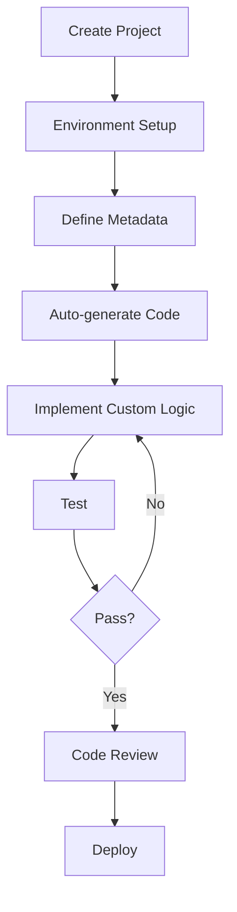

# Development Workflow Guidelines

This document defines the standard development workflow for the ${PLATFORM_NAME} platform.

> **Language**: For Korean version, see [02-development-workflow.kr.md](./02-development-workflow.kr.md)

## 🔄 Overall Development Process



## 1️⃣ Project Creation

### Create New Project
```bash
cd /var/services/homes/jungsam/dev/dockers/platforms/${PLATFORM_NAME}/projects
./create-project.sh -p ${PLATFORM_NAME} -n <project-name> -u <github-user> -d "Project description"
```

### Automatic Configuration After Creation
- ✅ Automatic port allocation (20 ports)
- ✅ GitHub repository creation
- ✅ Environment variable file generation
- ✅ Docker configuration creation
- ✅ Basic project structure generation

### Verify Creation
```bash
# Check project directory
cd projects/<project-name>
ls -la

# Check allocated ports
cat .env | grep PORT

# Start Docker containers
docker-compose up -d
```

## 2️⃣ Environment Setup

### Check and Modify Environment Variables
```bash
# Check .env file
cat .env

# Add custom environment variables if needed
vim .env
```

### Key Environment Variables
```bash
# Auto-allocated ports (NEVER modify these)
PROJECT_SSH_PORT=21XXX
PROJECT_API_PORT=21XXX
PROJECT_FRONTEND_PORT=21XXX

# Database connection (platform shared)
POSTGRES_HOST=${BASE_IP}
POSTGRES_PORT=${PLATFORM_POSTGRES_PORT}
DATABASE_URL=postgresql://...

# Custom environment variables (add per project)
JWT_SECRET=your-secret-here
API_KEY=your-api-key
```

### Create Database
```bash
# Create project-dedicated database
npm run db:create

# Or manual creation
psql -h ${BASE_IP} -p ${PLATFORM_POSTGRES_PORT} -U ${POSTGRES_USER}
CREATE DATABASE project_<project-name>;
```

## 3️⃣ Define Metadata

### Metadata Structure
```
projects/<project-name>/
└── metadata/
    ├── tables/          # Table definitions
    │   ├── users.json
    │   ├── posts.json
    │   └── comments.json
    ├── relationships/   # Relationship definitions
    │   └── user-posts.json
    └── apis/           # API definitions
        └── graphql-schema.json
```

### Table Metadata Example (metadata/tables/users.json)
```json
{
  "tableName": "users",
  "description": "User information table",
  "columns": [
    {
      "name": "id",
      "type": "uuid",
      "primaryKey": true,
      "generated": true
    },
    {
      "name": "email",
      "type": "varchar",
      "length": 255,
      "unique": true,
      "nullable": false
    },
    {
      "name": "password",
      "type": "varchar",
      "length": 255,
      "nullable": false,
      "exclude": ["graphql", "api"]
    },
    {
      "name": "role",
      "type": "enum",
      "enum": ["USER", "ADMIN"],
      "default": "USER"
    },
    {
      "name": "createdAt",
      "type": "timestamp",
      "default": "now()"
    }
  ],
  "indexes": [
    {
      "columns": ["email"],
      "unique": true
    }
  ]
}
```

### Relationship Metadata Example (metadata/relationships/user-posts.json)
```json
{
  "type": "one-to-many",
  "from": "users",
  "to": "posts",
  "foreignKey": "user_id",
  "onDelete": "CASCADE",
  "onUpdate": "CASCADE"
}
```

## 4️⃣ Auto-Generate Code

### Using AI (Claude Code)
```bash
# Generate all code from metadata
claude-code "Generate TypeORM entities, GraphQL schema, and resolvers from metadata/tables/*.json"
```

### Using Automation Scripts
```bash
# Generate entities
npm run generate:entities

# Generate GraphQL schema
npm run generate:schema

# Generate resolvers
npm run generate:resolvers

# Generate all at once
npm run generate:all
```

### Generated Files
```
src/
├── entities/
│   ├── User.ts          # TypeORM entity
│   └── Post.ts
├── schema/
│   ├── users.ts         # GraphQL schema
│   └── posts.ts
├── resolvers/
│   ├── users.ts         # GraphQL resolvers
│   └── posts.ts
└── services/
    ├── user.service.ts  # CRUD services
    └── post.service.ts
```

## 5️⃣ Implement Custom Logic

### Add Business Logic
```typescript
// src/services/user.service.ts
export class UserService {
  // Auto-generated CRUD methods
  async findAll(): Promise<User[]> { /*...*/ }
  async findOne(id: string): Promise<User> { /*...*/ }

  // ✅ Add custom logic here
  async findByEmail(email: string): Promise<User | null> {
    return this.userRepository.findOne({ where: { email } });
  }

  async updatePassword(id: string, newPassword: string): Promise<void> {
    const user = await this.findOne(id);
    user.password = await bcrypt.hash(newPassword, 10);
    await this.userRepository.save(user);
  }
}
```

### Extend GraphQL Resolvers
```typescript
// src/resolvers/users.ts
export const userResolvers = {
  Query: {
    // Auto-generated queries
    usersAll: () => userService.findAll(),
    usersOne: (_, { id }) => userService.findOne(id),

    // ✅ Add custom queries
    userByEmail: (_, { email }) => userService.findByEmail(email),
  },

  Mutation: {
    // Auto-generated mutations
    userCreate: (_, { input }) => userService.create(input),

    // ✅ Add custom mutations
    updatePassword: (_, { id, newPassword }) =>
      userService.updatePassword(id, newPassword),
  },
};
```

## 6️⃣ Testing

### Unit Tests
```bash
# Run unit tests
npm run test:unit

# Watch mode
npm run test:watch

# Coverage
npm run test:coverage
```

### Integration Tests
```bash
# Run integration tests
npm run test:integration

# Test specific module
npm run test:integration -- users
```

### Example Test
```typescript
// tests/unit/user.service.test.ts
describe('UserService', () => {
  it('should find user by email', async () => {
    const user = await userService.findByEmail('test@example.com');
    expect(user).toBeDefined();
    expect(user.email).toBe('test@example.com');
  });
});
```

## 7️⃣ Code Review

### Pre-Review Checklist
- [ ] All tests passing
- [ ] TypeScript strict mode compliance
- [ ] GraphQL naming conventions followed
- [ ] Error handling implemented
- [ ] Environment variables documented
- [ ] No hardcoded values
- [ ] Documentation updated

### Review Process
1. **Self-review**: Check your own code first
2. **AI review**: Use Gemini CLI for code review
   ```bash
   gemini "Review src/services/user.service.ts for best practices"
   ```
3. **Peer review**: Create pull request
4. **Approval**: Merge after approval

## 8️⃣ Deployment

### Development Deployment
```bash
# Build
npm run build

# Start in development mode
npm run dev
```

### Production Deployment
```bash
# Build production
npm run build:prod

# Run migrations
npm run migration:run

# Start production server
npm run start:prod
```

### Docker Deployment
```bash
# Build Docker image
docker build -t ${PROJECT_NAME}:latest .

# Run container
docker run -d \
  -p ${PROJECT_API_PORT}:${PROJECT_API_PORT} \
  --env-file .env \
  ${PROJECT_NAME}:latest
```

## 🔄 Continuous Development Workflow

### Daily Workflow
1. **Pull latest changes**
   ```bash
   git pull origin main
   ```

2. **Create feature branch**
   ```bash
   git checkout -b feature/user-authentication
   ```

3. **Develop with AI assistance**
   ```bash
   claude-code "Implement JWT authentication for User entity"
   ```

4. **Test continuously**
   ```bash
   npm run test:watch
   ```

5. **Commit changes**
   ```bash
   git add .
   git commit -m "feat: Add JWT authentication"
   ```

6. **Push and create PR**
   ```bash
   git push origin feature/user-authentication
   gh pr create --title "Add JWT authentication"
   ```

### Metadata Update Workflow
1. **Modify metadata**
   ```bash
   vim metadata/tables/users.json
   ```

2. **Regenerate code**
   ```bash
   npm run generate:all
   ```

3. **Create migration**
   ```bash
   npm run migration:generate -- AddUserRole
   ```

4. **Test changes**
   ```bash
   npm run test:all
   ```

5. **Commit and deploy**
   ```bash
   git add .
   git commit -m "feat: Add user role field"
   npm run deploy
   ```

## 🚨 Common Pitfalls

### ❌ DON'T
1. **Modify auto-generated code directly**
   - Changes will be overwritten on next generation
   - ✅ Use custom services/resolvers instead

2. **Hardcode port numbers**
   - Always use environment variables
   - ✅ `process.env.PROJECT_API_PORT`

3. **Skip tests**
   - Tests ensure code quality
   - ✅ Write tests for custom logic

4. **Commit `.env` files**
   - Contains sensitive data
   - ✅ Use `.env.example` instead

### ✅ DO
1. **Use metadata for schema changes**
2. **Write tests for custom logic**
3. **Follow naming conventions**
4. **Document custom code**
5. **Use AI for repetitive tasks**

## 📊 Workflow Metrics

Track these metrics to improve:
- **Time to first deployment**: From project creation to first deploy
- **Code generation ratio**: Auto-generated vs custom code
- **Test coverage**: Unit + Integration
- **Deployment frequency**: How often you deploy
- **AI assistance usage**: % of code generated by AI

---

**Last Updated**: 2024-10-19
**Version**: 1.0.0

> **See Also**:
> - [AI Collaboration](./01-ai-collaboration.md) - AI usage guidelines
> - [Coding Conventions](./04-coding-conventions.md) - Code standards
> - [Platform Overview](../architecture/01-platform-overview.md) - Platform architecture
