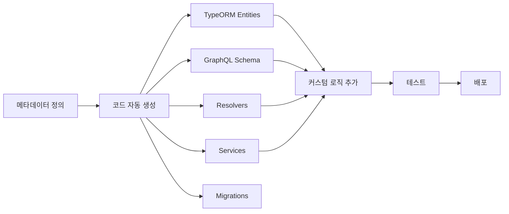

# 플랫폼 아키텍처 개요

## 🏗️ 전체 아키텍처

```
┌─────────────────────────────────────────────────────────────────┐
│                    ${PLATFORM_NAME} Platform                     │
├─────────────────────────────────────────────────────────────────┤
│                                                                 │
│  ┌───────────────┐  ┌───────────────┐  ┌───────────────┐      │
│  │  Project 1    │  │  Project 2    │  │  Project 3    │      │
│  │  (Ports:      │  │  (Ports:      │  │  (Ports:      │      │
│  │  21XXX-21XXX) │  │  21XXX-21XXX) │  │  21XXX-21XXX) │      │
│  └───────┬───────┘  └───────┬───────┘  └───────┬───────┘      │
│          │                  │                  │                │
│  ────────┴──────────────────┴──────────────────┴────────        │
│          │           Shared Infrastructure     │                │
│  ────────┴──────────────────────────────────────────────        │
│          │                                     │                │
│  ┌───────▼───────┐  ┌──────────────┐  ┌───────▼───────┐       │
│  │  PostgreSQL   │  │     N8N      │  │     MySQL     │       │
│  │  (${PLATFORM_POSTGRES_PORT})  │  │  (${PLATFORM_N8N_PORT}) │  │  (${PLATFORM_MYSQL_PORT})  │       │
│  └───────────────┘  └──────────────┘  └───────────────┘       │
│                                                                 │
└─────────────────────────────────────────────────────────────────┘
```

## 🎯 핵심 개념

### 1. 도메인 기반 격리
- 각 도메인(영역)은 독립적인 플랫폼으로 구성
- 플랫폼별로 전용 데이터베이스 서버와 N8N 인스턴스 보유
- 예: `ubuntu-ilmac`, `ubuntu-jnj`, `ubuntu-kmc`

### 2. 프로젝트 격리
- 각 프로젝트는 독립적인 포트 범위 할당 (10개)
- 프로젝트별 전용 데이터베이스 (공유 DB 서버 내)
- 독립적인 Git 저장소

### 3. 자동화된 포트 관리
- 플랫폼: 200개 포트 범위
- 프로젝트: 20개 포트 (Production 10 + Development 10)
- 충돌 방지를 위한 자동 할당 시스템

## 📊 포트 할당 체계

### 플랫폼 레벨
```
Platform SN = 0, 1, 2, ...
Base Port = 21000 + (SN × 200)

예시:
- Platform 0: 21000-21199
- Platform 1: 21200-21399
- Platform 2: 21400-21599
```

### 프로젝트 레벨
```
Project SN = 0, 1, 2, ... (플랫폼 내)
Project Base Port = Platform Base Port + (Project SN × 20)

예시 (Platform 1, Project 0):
- Base: 21200 + (0 × 20) = 21200
- Ports: 21200-21219
  - Production: 21200-21209
  - Development: 21210-21219
```

### 서비스별 포트 오프셋

**Production (0-9)**:
- 0: SSH
- 1: Backend Node.js
- 2: Backend Python
- 3: API GraphQL
- 4: API REST
- 5: API Reserved
- 6: Frontend Next.js
- 7: Frontend SvelteKit
- 8: Frontend Reserved
- 9: System Reserved

**Development (10-19)**: Production + 10

## 🗃️ 데이터베이스 아키텍처

### 공유 인스턴스 전략
```
┌─────────────────────────────────────┐
│   PostgreSQL Instance               │
│   (Port: ${PLATFORM_POSTGRES_PORT}) │
├─────────────────────────────────────┤
│                                     │
│  ┌──────────────────────────────┐  │
│  │ platform_metadata            │  │  ← 플랫폼 메타데이터
│  └──────────────────────────────┘  │
│                                     │
│  ┌──────────────────────────────┐  │
│  │ project_user_management      │  │  ← 프로젝트 1 DB
│  └──────────────────────────────┘  │
│                                     │
│  ┌──────────────────────────────┐  │
│  │ project_blog                 │  │  ← 프로젝트 2 DB
│  └──────────────────────────────┘  │
│                                     │
│  ┌──────────────────────────────┐  │
│  │ project_ecommerce            │  │  ← 프로젝트 3 DB
│  └──────────────────────────────┘  │
│                                     │
└─────────────────────────────────────┘
```

### 데이터베이스 네이밍 규칙
- 플랫폼 메타데이터: `platform_metadata`
- 프로젝트 DB: `project_${PROJECT_NAME}`
- 예: `project_user_management`, `project_blog`

## 🔄 메타데이터 기반 개발 흐름



### 메타데이터 구조
```json
{
  "tableName": "users",
  "columns": [
    { "name": "id", "type": "uuid", "primaryKey": true },
    { "name": "email", "type": "varchar", "unique": true },
    { "name": "role", "type": "enum", "enum": ["USER", "ADMIN"] }
  ],
  "relationships": [
    { "type": "one-to-many", "target": "posts", "foreignKey": "user_id" }
  ]
}
```

### 자동 생성되는 코드
1. **TypeORM Entities**: 데이터베이스 모델
2. **GraphQL Schema**: API 스키마 정의
3. **Resolvers**: GraphQL 쿼리/뮤테이션 핸들러
4. **Services**: 비즈니스 로직 (CRUD)
5. **Migrations**: DB 스키마 마이그레이션

## 🛠️ 기술 스택

### Backend
- **Runtime**: Node.js (TypeScript)
- **API**: GraphQL (Apollo Server)
- **ORM**: TypeORM
- **Database**: PostgreSQL (primary), MySQL (optional)

### Frontend
- **Framework**: Next.js (App Router)
- **UI**: React 19
- **Styling**: Tailwind CSS 4

### Infrastructure
- **Containerization**: Docker
- **Automation**: N8N
- **Reverse Proxy**: Nginx (플랫폼 레벨)
- **SSL**: Certbot (플랫폼 레벨)

### Development Tools
- **AI Assistants**: Claude Code, Codex CLI, Gemini CLI
- **IDE**: VS Code / Cursor (서버 설정 영구 저장)
- **Version Control**: Git + GitHub

## 📁 디렉토리 구조

### 플랫폼 레벨
```
platforms/${PLATFORM_NAME}/
├── docker-compose.yml        # 인프라 서비스 정의
├── .env                      # 플랫폼 환경변수
├── configs/                  # 설정 파일들
│   ├── .bashrc
│   ├── ide/                 # VS Code/Cursor 서버 설정
│   ├── n8n_data/            # N8N 워크플로우 데이터
│   └── google-chrome/       # Chrome 사용자 데이터
├── projects/                 # 프로젝트들
│   ├── cp.sh                # 프로젝트 생성 스크립트
│   ├── project-1/
│   ├── project-2/
│   └── project-3/
├── scripts/                  # 자동화 스크립트
│   ├── dev-start.sh
│   ├── backup-db.sh
│   └── port-check.sh
└── docs/                     # 플랫폼 문서
    ├── guidelines/
    ├── architecture/
    ├── api/
    └── troubleshooting/
```

### 프로젝트 레벨
```
projects/project-name/
├── src/                      # 소스 코드
│   ├── entities/            # TypeORM 엔티티 (자동 생성)
│   ├── schema/              # GraphQL 스키마 (자동 생성)
│   ├── resolvers/           # GraphQL 리졸버 (자동 생성)
│   ├── services/            # 비즈니스 로직 (자동 생성)
│   ├── custom/              # 커스텀 코드 (수동 작성)
│   ├── utils/               # 유틸리티
│   ├── types/               # 타입 정의
│   └── index.ts             # 진입점
├── metadata/                 # 메타데이터 정의
│   ├── tables/
│   ├── relationships/
│   └── apis/
├── migrations/               # DB 마이그레이션
├── tests/                    # 테스트 코드
├── .env                      # 프로젝트 환경변수
├── docker-compose.yml        # Docker 설정
├── package.json
└── README.md
```

## 🔐 보안 아키텍처

### 네트워크 격리
- 각 프로젝트는 독립적인 Docker 네트워크
- 외부 접근은 역방향 프록시(Nginx)를 통해서만 가능

### 인증/인가
- JWT 기반 인증
- GraphQL Context를 통한 사용자 정보 전파
- Role-based Access Control (RBAC)

### 환경변수 관리
- `.env` 파일로 관리 (git ignore)
- 민감 정보는 환경변수로만 접근
- 자동 생성된 시크릿 (비밀번호, JWT secret 등)

## 📈 확장성

### 수평 확장
- 프로젝트별 독립 배포
- 프로젝트 추가 시 자동 포트 할당
- 최대 10개 프로젝트/플랫폼, 45개 플랫폼 지원

### 수직 확장
- 데이터베이스 커넥션 풀링
- Redis 캐싱 (선택적)
- N8N 워크플로우를 통한 백그라운드 작업

## 🔄 개발 및 배포 흐름

### 개발 환경
```bash
# 플랫폼 생성
./cu.sh -n ubuntu-myplatform -u myuser -d "My Platform"

# 프로젝트 생성
cd platforms/ubuntu-myplatform/projects
./create-project.sh -p ubuntu-myplatform -n my-project -u myuser -d "My Project"

# 개발 시작
cd my-project
npm install
npm run dev
```

### 코드 생성 워크플로우
```bash
# 메타데이터 정의
vim metadata/tables/users.json

# 코드 자동 생성
npm run generate:all

# 커스텀 로직 추가
vim src/custom/services/user.service.custom.ts

# 테스트
npm test

# 마이그레이션
npm run migration:run
```

### 배포
```bash
# 빌드
npm run build

# 프로덕션 시작
docker-compose up -d
```

## 🎓 학습 경로

1. **플랫폼 이해** (이 문서)
2. **개발 워크플로우** (`/docs/guidelines/02-development-workflow.md`)
3. **데이터베이스 관리** (`/docs/guidelines/03-database-management.md`)
4. **코딩 컨벤션** (`/docs/guidelines/04-coding-conventions.md`)
5. **AI 협업** (`/docs/guidelines/01-ai-collaboration.md`)
6. **예제 프로젝트** (`/docs/examples/`)

## 🔗 관련 문서

- [메타데이터 스키마 정의](./02-metadata-schema.md)
- [GraphQL API 설계](../api/01-graphql-design.md)
- [포트 할당 시스템](./03-port-allocation.md)
- [데이터베이스 설계 원칙](../guidelines/03-database-management.md)
