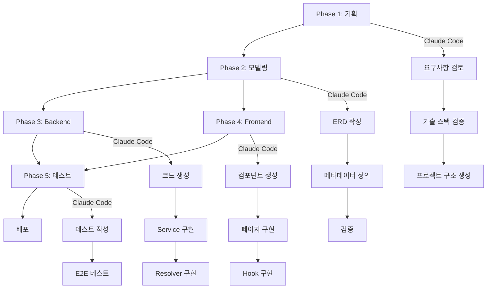

# Claude Code를 활용한 메타데이터 기반 Fullstack 개발 가이드

> PostgreSQL + GraphQL + TypeScript + Next.js 스택을 사용한 사용자 인증/권한 시스템 개발

## 📚 전체 문서 구조

이 가이드는 메타데이터 기반 개발 방법론을 사용하여 실전 Fullstack 애플리케이션을 개발하는 과정을 5단계로 나누어 설명합니다.

### 개발 단계

1. **[Phase 1: 기획](./CLAUDE-CODE-DEVELOPMENT-GUIDE.md)**
   - 요구사항 분석 및 검증
   - 기술 스택 결정
   - 프로젝트 구조 설계
   - 데이터베이스 연결 설정
   - 보안 정책 정의
   - API 설계 초안

2. **[Phase 2: 모델링](./PHASE-2-MODELING.md)**
   - 메타데이터 DB 초기화
   - 도메인 모델 설계 (ERD)
   - 메타데이터 정의 (테이블/컬럼)
   - 관계 정의
   - 초기 데이터 정의
   - 메타데이터 검증

3. **[Phase 3: Backend 개발](./PHASE-3-BACKEND.md)**
   - 코드 생성 스크립트 작성
   - 데이터베이스 스키마 생성
   - GraphQL 스키마 생성
   - TypeScript 타입 생성
   - Resolver 구현
   - Service 레이어 작성
   - Middleware 구현
   - Apollo Server 설정

4. **[Phase 4: Frontend 개발](./PHASE-4-FRONTEND.md)**
   - Apollo Client 설정
   - React 컴포넌트 자동 생성
   - 인증 페이지 구현
   - 사용자 프로필 페이지
   - 관리자 페이지
   - 인증/권한 시스템
   - Protected Route

5. **[Phase 5: 테스트 및 배포](./PHASE-5-TESTING-DEPLOYMENT.md)**
   - Backend 통합 테스트
   - Frontend E2E 테스트
   - 성능 테스트
   - Docker 배포
   - CI/CD 설정
   - 모니터링 설정

---

## 🎯 프로젝트 개요

### 목표
사용자 인증 및 역할 기반 권한 관리(RBAC) 시스템을 메타데이터 기반으로 개발

### 주요 기능
- ✅ 회원가입 / 로그인 / 로그아웃
- ✅ JWT 기반 인증
- ✅ 역할 기반 권한 관리 (Admin, Manager, User)
- ✅ 이메일 인증
- ✅ 비밀번호 재설정
- ✅ 사용자 프로필 관리
- ✅ 관리자 대시보드
- ✅ 사용자 활동 로그

### 기술 스택

| Layer | Technology |
|-------|-----------|
| **Database** | PostgreSQL 14 (원격 서버) |
| **Backend** | Node.js 20 + TypeScript + Apollo Server |
| **GraphQL** | GraphQL + Code Generator |
| **Frontend** | Next.js 15.5.4 + React 19 |
| **UI** | shadcn/ui + Tailwind CSS 4 |
| **Auth** | JWT + bcrypt |
| **Testing** | Jest + Playwright + K6 |
| **Deployment** | Docker + GitHub Actions |

---

## 🚀 빠른 시작

### 1단계: 환경 설정

```bash
# Node.js 20 설치 확인
node --version  # v20.x.x

# 프로젝트 생성
mkdir auth-system && cd auth-system
mkdir -p backend frontend database

# 메타데이터 DB 생성 (원격 PostgreSQL)
psql -h <metadata-db-host> -U postgres -c "CREATE DATABASE auth_metadata;"
```

### 2단계: 메타데이터 정의

```sql
-- 메타데이터 스키마 생성
psql -h <metadata-db-host> -U postgres -d auth_metadata -f scripts/init-metadata.sql

-- 프로젝트 등록
INSERT INTO projects (project_id, project_name, root_path) VALUES
('auth-system', 'Auth System', '/workspace/auth-system');

-- 테이블 메타데이터 정의
INSERT INTO _metadata.mappings_table (schema_name, table_name, graphql_type, label) VALUES
('public', 'users', 'User', '사용자');

-- 컬럼 메타데이터 정의
INSERT INTO _metadata.mappings_column (...) VALUES (...);
```

### 3단계: 코드 생성

```bash
# Backend
cd backend
npm install
npm run generate:all  # DDL, GraphQL, Types, Resolvers 생성

# Frontend
cd frontend
npm install
npm run generate:all  # React Forms, Tables 생성
```

### 4단계: 개발 서버 실행

```bash
# Backend (Terminal 1)
cd backend
npm run dev  # http://localhost:4000/graphql

# Frontend (Terminal 2)
cd frontend
npm run dev  # http://localhost:3000
```

---

## 📖 Claude Code 프롬프트 사용법

### 기획 단계 프롬프트 예시

```
다음 사용자 인증/권한 시스템 요구사항을 검토하고 누락된 부분이나 개선점을 제안해주세요:

요구사항:
- 사용자 관리: 회원가입, 로그인, 프로필 관리
- 역할 기반 권한 관리 (RBAC): Admin, Manager, User
- JWT 기반 인증
...

다음 관점에서 검토해주세요:
1. 보안 측면에서 누락된 기능
2. 사용자 경험 개선 사항
3. 확장성 고려사항
```

### 모델링 단계 프롬프트 예시

```
사용자 인증/권한 시스템의 ERD를 작성하고 메타데이터 SQL을 생성해주세요:

엔티티:
1. users (사용자)
2. roles (역할)
3. permissions (권한)
4. user_roles (사용자-역할 매핑)
...

요청사항:
1. ERD 다이어그램 (Mermaid 형식)
2. 관계 정의 (1:N, N:M)
3. 메타데이터 테이블 INSERT SQL 생성
```

### Backend 개발 프롬프트 예시

```
메타데이터 기반으로 GraphQL Resolver를 생성해주세요:

작업:
1. 생성된 Resolver 확인
2. 커스텀 Resolver 작성
   - auth-resolvers.ts (로그인, 회원가입 등)
3. Resolver 병합

다음 기능을 포함:
- CRUD 기본 리졸버 (자동 생성)
- 권한 체크 데코레이터
- DataLoader를 통한 N+1 해결
```

### Frontend 개발 프롬프트 예시

```
회원가입 페이지를 구현해주세요:

요구사항:
1. RegisterInput 폼 (email, password, 이름 등)
2. GraphQL Mutation 사용
3. 에러 처리
4. 성공 시 리다이렉트

UI 라이브러리: shadcn/ui
```

---

## 🗂️ 프로젝트 구조

```
auth-system/
├── backend/
│   ├── src/
│   │   ├── generated/           # 🤖 자동 생성 (수정 금지)
│   │   │   ├── schema.graphql
│   │   │   ├── types.ts
│   │   │   ├── resolvers/
│   │   │   └── services/
│   │   ├── custom/              # ✏️ 커스텀 코드
│   │   │   ├── resolvers/
│   │   │   │   └── auth-resolvers.ts
│   │   │   └── services/
│   │   │       └── auth-service.ts
│   │   ├── middleware/
│   │   │   ├── auth.ts
│   │   │   └── authorization.ts
│   │   └── index.ts
│   ├── tests/
│   └── package.json
│
├── frontend/
│   ├── src/
│   │   ├── generated/           # 🤖 자동 생성
│   │   │   ├── forms/
│   │   │   └── tables/
│   │   ├── components/          # ✏️ 커스텀 컴포넌트
│   │   ├── app/
│   │   │   ├── (auth)/
│   │   │   │   ├── login/
│   │   │   │   └── register/
│   │   │   └── (app)/
│   │   │       ├── profile/
│   │   │       └── admin/
│   │   └── hooks/
│   │       └── use-auth.ts
│   ├── tests/
│   └── package.json
│
├── database/
│   ├── migrations/
│   └── seeds/
│
├── scripts/
│   └── generators/
│
└── docker-compose.yml
```

---

## 🔑 핵심 개념

### 1. Single Source of Truth

```
Metadata DB (PostgreSQL)
        ↓
    메타데이터 정의
        ↓
  코드 생성 엔진
        ↓
   ┌─────┴─────┐
   ↓           ↓
Backend    Frontend
```

모든 스키마 정보는 메타데이터 DB에서 관리되며, 이를 기반으로 코드가 자동 생성됩니다.

### 2. 생성 코드 vs 커스텀 코드

```typescript
// ✅ 올바른 방법: 생성된 코드 확장
import { UserService as GeneratedUserService } from '@/generated/services';

export class UserService extends GeneratedUserService {
  // 커스텀 메서드 추가
  async findByEmail(email: string) { }
}

// ❌ 잘못된 방법: 생성 파일 직접 수정
// generated/services/user-service.ts를 수정하지 마세요!
```

### 3. 자동 동기화

메타데이터가 변경되면 코드가 자동으로 재생성됩니다.

```bash
# Watch 모드 실행
npm run dev:watch

# 메타데이터 변경 감지 → 자동 재생성
```

---

## 🎓 학습 가이드

### 개발자 역할별 가이드

#### Backend 개발자
1. [Phase 2: 모델링](./PHASE-2-MODELING.md) - ERD 및 메타데이터 정의
2. [Phase 3: Backend](./PHASE-3-BACKEND.md) - GraphQL API 개발
3. [Phase 5: Testing](./PHASE-5-TESTING-DEPLOYMENT.md) - API 테스트

#### Frontend 개발자
1. [Phase 4: Frontend](./PHASE-4-FRONTEND.md) - React 컴포넌트 개발
2. [Phase 5: Testing](./PHASE-5-TESTING-DEPLOYMENT.md) - E2E 테스트

#### Fullstack 개발자
모든 단계를 순차적으로 진행

#### DevOps 엔지니어
1. [Phase 1: 기획](./CLAUDE-CODE-DEVELOPMENT-GUIDE.md) - 인프라 설계
2. [Phase 5: 배포](./PHASE-5-TESTING-DEPLOYMENT.md) - Docker 및 CI/CD

---

## 📊 개발 프로세스



---

## 🛠️ 개발자 의사결정 포인트

### Phase 1: 기획 단계

| 의사결정 사항 | 옵션 | 권장 |
|--------------|------|------|
| 비밀번호 정책 | 최소 길이, 복잡도 | 최소 8자 + 대소문자+숫자+특수문자 |
| JWT 만료 시간 | Access/Refresh | 15분 / 7일 |
| 2FA 사용 여부 | 사용/미사용 | 선택적 사용 (Phase 2에서 추가) |
| 이메일 인증 | 필수/선택 | 필수 |

### Phase 2: 모델링 단계

| 의사결정 사항 | 옵션 | 권장 |
|--------------|------|------|
| 역할 타입 | Enum/String | Enum (타입 안정성) |
| 권한 세분화 | 리소스별/기능별 | 리소스별 CRUD |
| 활동 로그 | 전체/일부 | 인증 관련만 |
| 토큰 저장 | DB/Redis | DB (간단함) → Redis (확장 시) |

### Phase 3: Backend 단계

| 의사결정 사항 | 옵션 | 권장 |
|--------------|------|------|
| ORM 사용 | Prisma/Raw SQL | Raw SQL (메타데이터 기반) |
| GraphQL 서버 | Apollo/Express GraphQL | Apollo Server |
| 에러 처리 | 표준화/자유 | GraphQL Error Extensions |
| 로깅 | Winston/Pino | Winston |

### Phase 4: Frontend 단계

| 의사결정 사항 | 옵션 | 권장 |
|--------------|------|------|
| 상태 관리 | Context/Zustand/Redux | Context (간단함) |
| 폼 라이브러리 | React Hook Form/Formik | React Hook Form |
| UI 라이브러리 | shadcn/MUI/Ant Design | shadcn/ui |
| 토큰 저장 | localStorage/Cookie | localStorage (SPA) |

### Phase 5: 배포 단계

| 의사결정 사항 | 옵션 | 권장 |
|--------------|------|------|
| 컨테이너화 | Docker/없음 | Docker |
| CI/CD | GitHub Actions/GitLab CI | GitHub Actions |
| 호스팅 | AWS/Vercel/Self-hosted | Self-hosted (Docker) |
| 모니터링 | Prometheus/DataDog | Prometheus + Grafana |

---

## 💡 Best Practices

### 메타데이터 관리
- ✅ 명명 규칙 일관성 유지 (snake_case for DB, camelCase for GraphQL)
- ✅ 상세한 라벨 및 설명 작성
- ✅ validation 규칙 명확히 정의
- ❌ 생성된 코드 직접 수정 금지

### 보안
- ✅ 환경 변수로 민감 정보 관리
- ✅ JWT Secret 강력하게 설정
- ✅ SQL Injection 방지 (Parameterized Queries)
- ✅ XSS 방지 (Input Sanitization)
- ❌ 비밀번호 평문 저장 금지

### 성능
- ✅ DataLoader로 N+1 문제 해결
- ✅ Connection Pooling 사용
- ✅ 적절한 인덱스 설정
- ✅ GraphQL Query 복잡도 제한

### 테스트
- ✅ 단위 테스트 (Service 레이어)
- ✅ 통합 테스트 (GraphQL API)
- ✅ E2E 테스트 (주요 플로우)
- ✅ 성능 테스트 (부하 테스트)

---

## 🔗 참고 자료

### 메타데이터 기반 개발 문서
- [워크플로우 가이드](./META-DRIVEN-DEVELOPMENT-WORKFLOW.md)
- [개발 가이드라인](./META-DRIVEN-DEVELOPMENT-GUIDELINES.md)
- [코드 생성 템플릿](./CODE-GENERATION-TEMPLATES.md)

### 외부 문서
- [PostgreSQL 공식 문서](https://www.postgresql.org/docs/)
- [GraphQL 공식 문서](https://graphql.org/)
- [Apollo Server 문서](https://www.apollographql.com/docs/apollo-server/)
- [Next.js 공식 문서](https://nextjs.org/docs)
- [shadcn/ui 문서](https://ui.shadcn.com/)

---

## 🤝 기여 및 문의

### 이슈 리포트
문제가 발생하거나 개선 사항이 있으면 이슈를 등록해주세요.

### 문서 개선
이 가이드는 지속적으로 업데이트됩니다. 개선 사항을 제안해주세요.

---

## 📝 변경 이력

- **v1.0.0** (2024-10-19)
  - 초기 가이드 작성
  - 5단계 프로세스 정립
  - 사용자 인증/권한 시스템 예제 완성

---

**Happy Coding! 🚀**

메타데이터 기반 개발로 더 빠르고 일관된 코드를 생성하세요!
