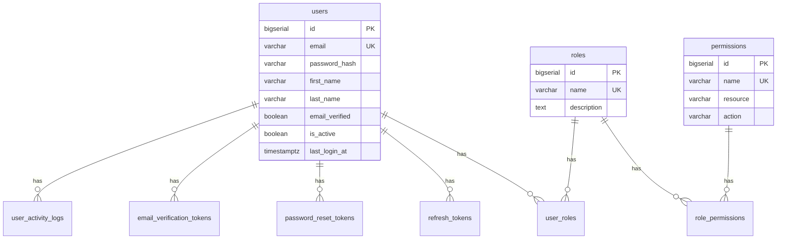

# Phase 2: 모델링 단계 - Claude Code 프롬프트

> 메타데이터 DB에 테이블 및 컬럼 정의를 생성하는 단계

## 📚 사전 준비: 메타데이터 테이블 이해

**먼저 읽어야 할 문서**: [Phase 1: 메타데이터 테이블 초기화](./PHASE-1-METADATA-TABLES-SETUP.md)

이 문서에는 다음 내용이 포함되어 있습니다:
- 📋 메타데이터 테이블 목록 및 구조
- 💾 완전한 초기화 SQL 스크립트 (`00-metadata-tables.sql`)
- ✅ 검증 및 테스트 방법
- 🔧 백업 및 복원 가이드

**핵심 테이블**:
- `mappings_table` - 테이블 레벨 메타데이터
- `mappings_column` - 컬럼 레벨 메타데이터 (DB, GraphQL, UI 설정)
- `mappings_relation` - 테이블 간 관계 정의
- `projects` - 프로젝트 관리
- `project_tables` - 프로젝트별 테이블 매핑

---

## 2.1 메타데이터 DB 초기화

### 프롬프트 2-1: 메타데이터 DB 설정

```
메타데이터 관리를 위한 PostgreSQL 데이터베이스를 설정해주세요:

요구사항:
1. 원격 PostgreSQL 서버에 메타데이터 DB 생성
   - DB명: auth_metadata
   - 스키마: public

2. 메타데이터 테이블 생성
   - 다음 문서의 완전한 SQL 스크립트를 사용해주세요:
     /var/services/homes/jungsam/dev/dockers/_templates/docker/docker-ubuntu/_docs/meta-data-driven/workflows/PHASE-1-METADATA-TABLES-SETUP.md

   - 핵심 테이블:
     * mappings_table (테이블 메타데이터)
     * mappings_column (컬럼 메타데이터)
     * mappings_relation (관계 메타데이터)
     * projects (프로젝트 관리)
     * project_tables (프로젝트-테이블 매핑)
     * mappings_api_endpoint (외부 API 연동, 선택)
     * metadata_sync_log (변경 이력, 선택)

3. 연결 설정 파일 생성
   - scripts/db/metadata-connection.ts
   - scripts/db/init-metadata.sql (위 문서의 스크립트 사용)

참고 문서:
- 메타데이터 테이블 상세: ./PHASE-1-METADATA-TABLES-SETUP.md
- 전체 워크플로우: ../concepts/META-DRIVEN-DEVELOPMENT-WORKFLOW.md
```

**Claude가 생성할 파일:**

```sql
-- scripts/db/init-metadata.sql

-- Extensions
CREATE EXTENSION IF NOT EXISTS "uuid-ossp";

-- Enums
CREATE TYPE _metadata.relation_type_enum AS ENUM (
    'OneToOne', 'OneToMany', 'ManyToOne', 'ManyToMany'
);

CREATE TYPE _metadata.http_method_enum AS ENUM (
    'GET', 'POST', 'PUT', 'DELETE', 'PATCH'
);

CREATE TYPE _metadata.project_status_enum AS ENUM (
    'PLANNING', 'DEVELOPMENT', 'TESTING', 'PRODUCTION'
);

-- Tables
CREATE TABLE _metadata.mappings_table (
    id BIGSERIAL PRIMARY KEY,
    schema_name VARCHAR(100) NOT NULL DEFAULT 'public',
    table_name VARCHAR(100) NOT NULL,
    graphql_type VARCHAR(100),
    label VARCHAR(200) NOT NULL,
    description TEXT,
    primary_key VARCHAR(100) DEFAULT 'id',
    is_api_enabled BOOLEAN DEFAULT TRUE,
    api_permissions JSONB,
    created_at TIMESTAMPTZ DEFAULT NOW(),
    updated_at TIMESTAMPTZ DEFAULT NOW(),
    UNIQUE(schema_name, table_name)
);

-- (나머지 테이블 생성...)
```

---

## 2.2 도메인 모델 설계

### 프롬프트 2-2: 엔티티 관계 다이어그램 (ERD) 작성

```
사용자 인증/권한 시스템의 ERD를 작성하고 메타데이터 SQL을 생성해주세요:

엔티티:
1. users (사용자)
   - id (PK)
   - email (unique, required)
   - password_hash (required)
   - first_name
   - last_name
   - phone
   - avatar_url
   - email_verified (boolean)
   - is_active (boolean)
   - last_login_at
   - created_at
   - updated_at

2. roles (역할)
   - id (PK)
   - name (unique, required) - 'admin', 'manager', 'user'
   - description
   - created_at
   - updated_at

3. permissions (권한)
   - id (PK)
   - name (unique, required)
   - resource (테이블/리소스명)
   - action (create, read, update, delete)
   - description
   - created_at

4. user_roles (사용자-역할 매핑)
   - id (PK)
   - user_id (FK -> users)
   - role_id (FK -> roles)
   - created_at

5. role_permissions (역할-권한 매핑)
   - id (PK)
   - role_id (FK -> roles)
   - permission_id (FK -> permissions)
   - created_at

6. refresh_tokens (리프레시 토큰)
   - id (PK)
   - user_id (FK -> users)
   - token (unique)
   - expires_at
   - created_at

7. password_reset_tokens (비밀번호 재설정 토큰)
   - id (PK)
   - user_id (FK -> users)
   - token (unique)
   - expires_at
   - used (boolean)
   - created_at

8. email_verification_tokens (이메일 인증 토큰)
   - id (PK)
   - user_id (FK -> users)
   - token (unique)
   - expires_at
   - created_at

9. user_activity_logs (사용자 활동 로그)
   - id (PK)
   - user_id (FK -> users)
   - action (login, logout, password_change 등)
   - ip_address
   - user_agent
   - metadata (JSONB)
   - created_at

요청사항:
1. ERD 다이어그램 (Mermaid 형식)
2. 관계 정의 (1:N, N:M)
3. 메타데이터 테이블 INSERT SQL 생성
```

**예상 Claude 응답:**



---

## 2.3 메타데이터 정의 - Users 테이블

### 프롬프트 2-3: Users 테이블 메타데이터 생성

```
다음 users 테이블의 메타데이터를 생성해주세요:

참고 문서:
/var/services/homes/jungsam/dev/dockers/_templates/docker/docker-ubuntu/_docs/meta-data-driven/META-DRIVEN-DEVELOPMENT-GUIDELINES.md

테이블 정보:
- 테이블명: users
- GraphQL 타입: User
- 한글명: 사용자
- 설명: 시스템 사용자 정보

컬럼 정보:

1. id (BIGSERIAL)
   - GraphQL: id (ID!)
   - 라벨: ID
   - Primary Key
   - 폼: hidden

2. email (VARCHAR(255))
   - GraphQL: email (String!)
   - 라벨: 이메일
   - 폼: email
   - 필수: true
   - Unique: true
   - Indexed: true
   - 검증: 이메일 형식, 최대 255자
   - Placeholder: user@example.com

3. password_hash (VARCHAR(255))
   - GraphQL: - (출력 제외)
   - 라벨: 비밀번호
   - 폼: password
   - 필수: true
   - GraphQL Output: false
   - 설명: bcrypt 해시값 저장

4. first_name (VARCHAR(100))
   - GraphQL: firstName (String!)
   - 라벨: 이름
   - 폼: text
   - 필수: true
   - 검증: 2-100자
   - Searchable: true

5. last_name (VARCHAR(100))
   - GraphQL: lastName (String!)
   - 라벨: 성
   - 폼: text
   - 필수: true
   - 검증: 2-100자
   - Searchable: true

6. phone (VARCHAR(20))
   - GraphQL: phone (String)
   - 라벨: 전화번호
   - 폼: tel
   - 검증: 전화번호 형식

7. avatar_url (VARCHAR(500))
   - GraphQL: avatarUrl (String)
   - 라벨: 프로필 이미지
   - 폼: url

8. email_verified (BOOLEAN)
   - GraphQL: emailVerified (Boolean!)
   - 라벨: 이메일 인증 여부
   - 폼: checkbox
   - 기본값: false

9. is_active (BOOLEAN)
   - GraphQL: isActive (Boolean!)
   - 라벨: 활성 상태
   - 폼: checkbox
   - 기본값: true
   - 필터링: true

10. last_login_at (TIMESTAMPTZ)
    - GraphQL: lastLoginAt (DateTime)
    - 라벨: 마지막 로그인
    - 폼: datetime (읽기 전용)

11. created_at (TIMESTAMPTZ)
    - GraphQL: createdAt (DateTime!)
    - 라벨: 생성일시
    - 기본값: NOW()
    - Sortable: true

12. updated_at (TIMESTAMPTZ)
    - GraphQL: updatedAt (DateTime!)
    - 라벨: 수정일시
    - 기본값: NOW()
    - Sortable: true

요청사항:
1. mappings_table INSERT SQL
2. mappings_column INSERT SQL (모든 컬럼)
3. 인덱스 설정 포함
4. 검증 규칙 JSON 형식으로
```

**예상 Claude 응답:**

```sql
-- 1. 테이블 메타데이터
INSERT INTO _metadata.mappings_table (
    schema_name, table_name, graphql_type,
    label, description, primary_key, is_api_enabled
) VALUES (
    'public', 'users', 'User',
    '사용자', '시스템 사용자 정보', 'id', true
);

-- 2. 컬럼 메타데이터
-- ID
INSERT INTO _metadata.mappings_column (
    table_id, schema_name, table_name,
    pg_column, pg_type,
    graphql_field, graphql_type,
    label, form_type,
    is_required, is_visible, is_primary_key,
    sort_order
) VALUES (
    (SELECT id FROM _metadata.mappings_table WHERE table_name = 'users'),
    'public', 'users',
    'id', 'BIGSERIAL',
    'id', 'ID',
    'ID', 'hidden',
    false, false, true,
    0
);

-- Email
INSERT INTO _metadata.mappings_column (
    table_id, schema_name, table_name,
    pg_column, pg_type,
    graphql_field, graphql_type,
    label, form_type,
    is_required, is_visible, is_unique, is_indexed, is_searchable,
    sort_order,
    validation_rules, placeholder
) VALUES (
    (SELECT id FROM _metadata.mappings_table WHERE table_name = 'users'),
    'public', 'users',
    'email', 'VARCHAR(255)',
    'email', 'String',
    '이메일', 'email',
    true, true, true, true, true,
    10,
    '{
        "required": true,
        "pattern": "^[a-zA-Z0-9._%+-]+@[a-zA-Z0-9.-]+\\.[a-zA-Z]{2,}$",
        "maxLength": 255,
        "transform": ["trim", "toLowerCase"]
    }'::jsonb,
    'user@example.com'
);

-- First Name
INSERT INTO _metadata.mappings_column (
    table_id, schema_name, table_name,
    pg_column, pg_type,
    graphql_field, graphql_type,
    label, form_type,
    is_required, is_visible, is_searchable,
    sort_order,
    validation_rules, placeholder
) VALUES (
    (SELECT id FROM _metadata.mappings_table WHERE table_name = 'users'),
    'public', 'users',
    'first_name', 'VARCHAR(100)',
    'firstName', 'String',
    '이름', 'text',
    true, true, true,
    20,
    '{
        "required": true,
        "minLength": 2,
        "maxLength": 100
    }'::jsonb,
    '이름을 입력하세요'
);

-- (나머지 컬럼들도 동일한 형식으로...)

-- Password Hash (GraphQL 출력 제외)
INSERT INTO _metadata.mappings_column (
    table_id, schema_name, table_name,
    pg_column, pg_type,
    graphql_field, graphql_type,
    label, form_type,
    is_required, is_visible,
    is_graphql_output,
    sort_order
) VALUES (
    (SELECT id FROM _metadata.mappings_table WHERE table_name = 'users'),
    'public', 'users',
    'password_hash', 'VARCHAR(255)',
    null, null,
    '비밀번호', 'password',
    true, false,
    false,
    15
);
```

---

## 2.4 메타데이터 정의 - Roles 테이블

### 프롬프트 2-4: Roles 테이블 메타데이터 생성

```
roles 테이블의 메타데이터를 생성해주세요:

테이블 정보:
- 테이블명: roles
- GraphQL 타입: Role
- 한글명: 역할
- 설명: 사용자 역할 정의

컬럼:
1. id (BIGSERIAL, PK)
2. name (VARCHAR(50), unique, required)
   - enum: 'admin', 'manager', 'user'
   - 라벨 매핑: admin=관리자, manager=매니저, user=일반사용자
3. description (TEXT)
4. created_at (TIMESTAMPTZ)
5. updated_at (TIMESTAMPTZ)

요청사항:
- enum_options 포함
- SELECT 폼 타입으로 설정
```

---

## 2.5 관계 정의

### 프롬프트 2-5: 테이블 간 관계 메타데이터 생성

```
다음 관계들의 메타데이터를 생성해주세요:

1. User - UserRole (1:N)
   - users.id -> user_roles.user_id
   - GraphQL: User.roles -> [Role!]!
   - Cascade delete: true

2. Role - UserRole (1:N)
   - roles.id -> user_roles.role_id
   - GraphQL: Role.users -> [User!]!
   - Cascade delete: false

3. User - RefreshToken (1:N)
   - users.id -> refresh_tokens.user_id
   - GraphQL: User.refreshTokens -> [RefreshToken!]!
   - Cascade delete: true

4. Role - RolePermission (1:N)
   - roles.id -> role_permissions.role_id
   - GraphQL: Role.permissions -> [Permission!]!
   - Cascade delete: true

5. Permission - RolePermission (1:N)
   - permissions.id -> role_permissions.permission_id
   - GraphQL: Permission.roles -> [Role!]!
   - Cascade delete: false

mappings_relation 테이블에 INSERT하는 SQL을 생성해주세요.
```

**예상 Claude 응답:**

```sql
-- 1. User -> UserRole (OneToMany)
INSERT INTO _metadata.mappings_relation (
    from_schema, from_table, from_column,
    to_schema, to_table, to_column,
    relation_type, graphql_field,
    is_cascade_delete, constraint_name
) VALUES (
    'public', 'users', 'id',
    'public', 'user_roles', 'user_id',
    'OneToMany',
    'userRoles',
    true,
    'fk_user_roles_user_id'
);

-- 2. UserRole -> Role (ManyToOne)
INSERT INTO _metadata.mappings_relation (
    from_schema, from_table, from_column,
    to_schema, to_table, to_column,
    relation_type, graphql_field,
    is_cascade_delete, constraint_name
) VALUES (
    'public', 'user_roles', 'role_id',
    'public', 'roles', 'id',
    'ManyToOne',
    'role',
    false,
    'fk_user_roles_role_id'
);

-- (나머지 관계들...)
```

---

## 2.6 초기 데이터 정의

### 프롬프트 2-6: Seed 데이터 생성

```
다음 초기 데이터를 생성해주세요:

1. Roles
   - admin (관리자)
   - manager (매니저)
   - user (일반 사용자)

2. Permissions
   users 리소스:
   - users.create
   - users.read
   - users.update
   - users.delete
   - users.list

   roles 리소스:
   - roles.create
   - roles.read
   - roles.update
   - roles.delete

   permissions 리소스:
   - permissions.read
   - permissions.manage

3. Role-Permission 매핑
   admin: 모든 권한
   manager: users.read, users.list, roles.read
   user: users.read (본인만)

4. 기본 Admin 사용자
   - email: admin@example.com
   - password: Admin@123 (bcrypt 해시)
   - role: admin

다음 파일을 생성:
- database/seeds/001_roles.sql
- database/seeds/002_permissions.sql
- database/seeds/003_role_permissions.sql
- database/seeds/004_admin_user.sql
```

---

## 2.7 메타데이터 검증

### 프롬프트 2-7: 메타데이터 무결성 검증

```
작성한 메타데이터의 무결성을 검증해주세요:

검증 항목:
1. 모든 테이블에 Primary Key가 있는가?
2. Foreign Key 관계가 올바르게 정의되었는가?
3. Unique 제약이 필요한 컬럼에 설정되었는가?
4. GraphQL 필드명이 camelCase인가?
5. 필수 필드에 validation_rules가 설정되었는가?
6. enum_options가 있는 필드에 올바르게 설정되었는가?
7. 순환 참조가 없는가?

다음 쿼리를 실행하여 검증:

```sql
-- 1. Primary Key 확인
SELECT table_name
FROM _metadata.mappings_table
WHERE id NOT IN (
    SELECT table_id FROM _metadata.mappings_column WHERE is_primary_key = true
);

-- 2. Foreign Key 무결성
SELECT *
FROM mappings_relation r
WHERE NOT EXISTS (
    SELECT 1 FROM _metadata.mappings_table t
    WHERE t.schema_name = r.from_schema
    AND t.table_name = r.from_table
);

-- 3. GraphQL 필드명 검증
SELECT table_name, pg_column, graphql_field
FROM _metadata.mappings_column
WHERE graphql_field ~ '[A-Z]';

-- (기타 검증 쿼리들...)
```

검증 결과를 리포트 형식으로 작성해주세요.
```

---

## 체크리스트

모델링 단계 완료 전 확인사항:

- [ ] 메타데이터 DB 초기화 완료
- [ ] ERD 작성 및 검토 완료
- [ ] 모든 테이블 메타데이터 정의 완료
  - [ ] users
  - [ ] roles
  - [ ] permissions
  - [ ] user_roles
  - [ ] role_permissions
  - [ ] refresh_tokens
  - [ ] password_reset_tokens
  - [ ] email_verification_tokens
  - [ ] user_activity_logs
- [ ] 모든 컬럼 메타데이터 정의 완료
- [ ] 관계 메타데이터 정의 완료
- [ ] 초기 데이터(Seed) 정의 완료
- [ ] 메타데이터 무결성 검증 완료
- [ ] PostgreSQL 연결 테스트 완료
